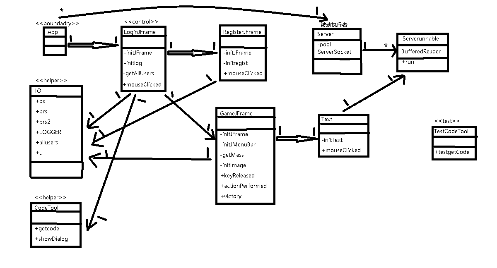

# Puzzlegame
## 系统结构  
本拼图游戏程序的项目名为puzzlegame,主要文件置于文件夹src下，data文件夹存储服务端接收的数据，lib文件夹存储外部依赖库，image文件夹存储程序中用到的图片。

在src文件夹下，App.class是客户端程序的main函数，Server.class是服务端程序的main函数，客户端与服务端通过TCP连接通信。Serverunnable是服务端的线程程序（实现了Runable接口），服务端利用了线程池。每开启一个App，会先尝试与服务端连接，若成功连接，就可进行后续的客户端和服务端发消息，若连接失败，则在一段时间连接超时后也会直接执行后续代码，但是是无连接的，即相当于离线的。每个客户端连接上服务端后，都会创建一个Serverunnable对象，线程池会分配一个线程来处理该Serverunnable对象，即接收对应客户端发来的信息。App然后执行new LoginJframe() 即打开登录界面。

在src文件夹下的com.hust文件夹下存放着程序的核心代码。Obj文件夹里是实体类，本程序中只有User类的javabean；test文件夹存放着单元测试代码（由于时间原因，这里只有TestCodeTool，即对获取验证码进行了测试代码的编写，其他测试代码类似）；tool文件夹下放着获取验证码的程序和程序中需要用到的IO流对象、allusers的Map集合（key为用户名，value为User对象）和日志对象（为方便使用，均声明为static，这样就可以直接以IO.对象的方式在整个项目中访问这些对象，类似全局的对象）；在ui文件夹下存储着游戏的UI界面的代码，包括GameJframe（游戏）、LoginJframe(登录)、RegisterJframe（注册）、Text（意见信息）。

在LoginJframe中，首先每次登陆都要先获取所有已经注册的用户对象以便和玩家输入的用户信息进行对比，该步骤通过getAllUsers方法实现，initJFrame和initlog用于初始化登录界面。LoginJframe实现了MouseListener接口，给登录和注册按钮绑定了鼠标点击事件。在用户点击了登录按钮后，程序会对用户输入的信息的完整性和正确性进行比对，若信息有误，则弹窗提示信息有误，若信息正确，则进入游戏界面，并同时给服务端发送用户登录消息，服务端收到消息存储在data/loginregister.txt里。而在用户点击了注册按钮后会跳转到注册界面。

在RegisterJframe中，与LoginJframe类似，initJFrame和initregist用于初始化注册界面，给重置和注册按钮绑定了事件，在注册信息无误并点击完注册按钮后，会将注册信息包装成一个User对象，存储在src/User1.txt里，并向服务端发送用户注册的信息，存储在data/loginregister.txt里，并返回登录界面。

在GameJframe中，也绑定了事件，但实现的是KeyListener和ActionListener接口，即可通过键盘↑↓←→控制图片移动来玩，实际上是通过改变图片的序号次序，然后通过initImage重新显示图片来实现移动的效果。同时也设置了两个功能键：“X”可以查看原图，“K”可以一键通关。在该类中还多了JMenuBar菜单栏，每一个菜单项均绑定了相应的功能。重新游戏即打乱重新开始，打乱对应getMass函数，重新登陆会回到登录界面，退出游戏即直接关闭进程，更换图片则会更改图片路径后重新展示。关于我们会弹出一张图片，意见在点了提交后，则会将消息发送到服务端的data/loginregister.txt文件。

最后，程序中出现的异常，会通过日志对象写入logback.xml中指定的客户端主机的C:/code/logdata.log位置。
***
类图如下：  

